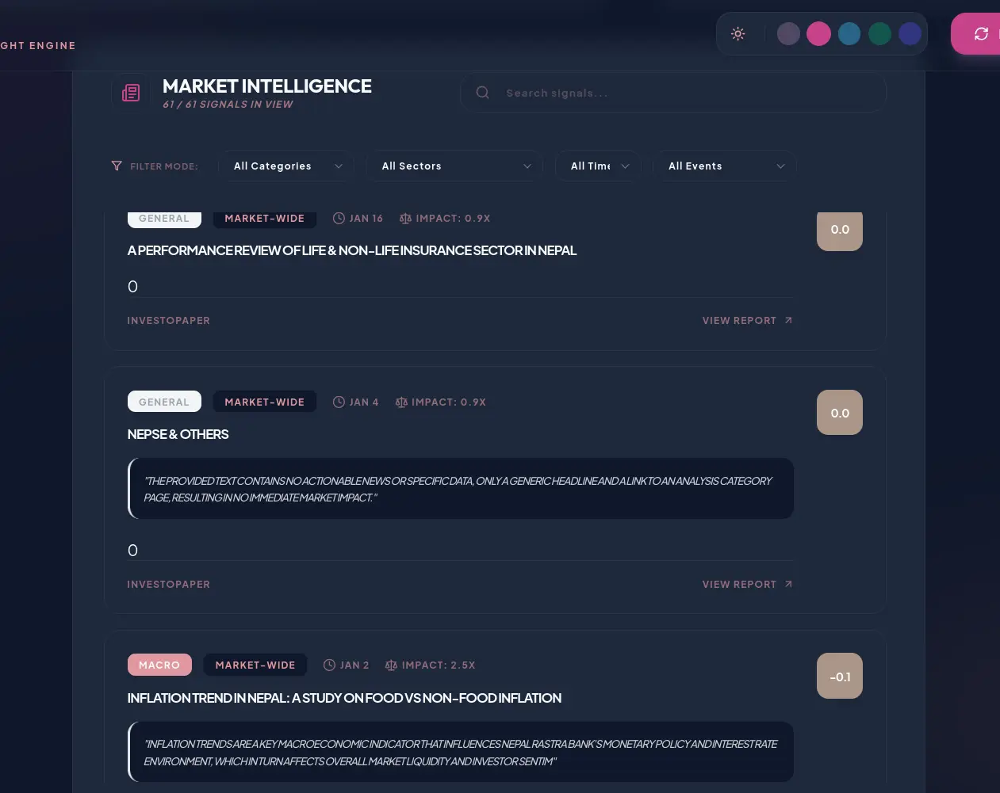
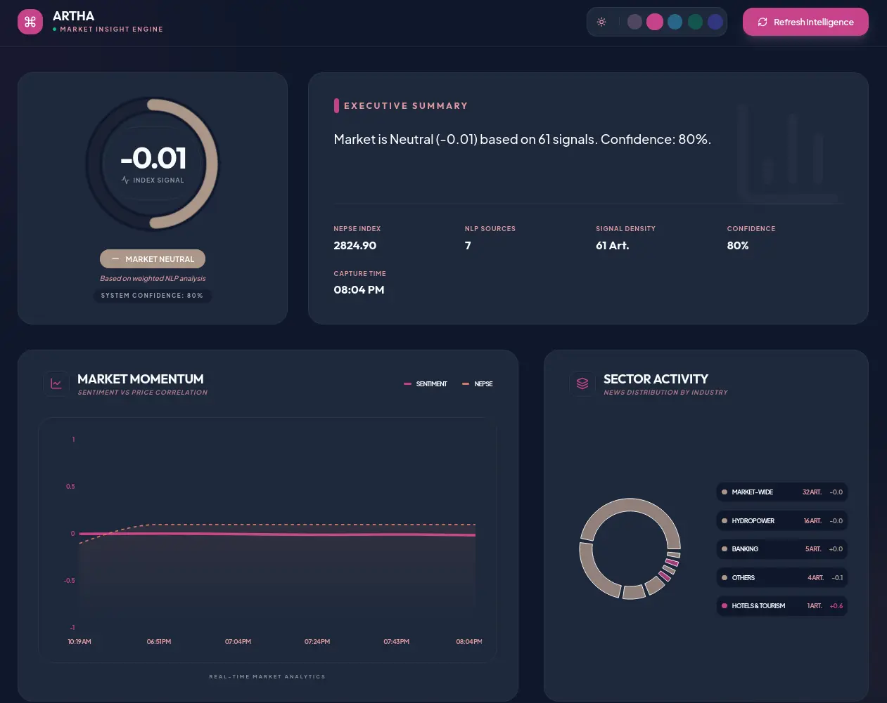

# Artha: Nepali Market Sentiment Engine

**Real-time sentiment analysis for NEPSE stock exchange using AI-powered news scraping.**

Automatically scrapes financial news from 7 major Nepali sources, analyzes market sentiment with Gemini AI, and calculates weighted signals for trading decisions.



## 🚀 How it Works

1. **Data Acquisition**: Scrapes news and live NEPSE index from authoritative sources.
2. **AI Intelligence**: Gemini 1.5 Flash performs sentiment analysis and sector classification in real-time.
3. **Deduplication**: Ensures multiple reports of the same event don't bias the sentiment score.
4. **Weighted Signaling**: Calculates a final market signal (-1 to +1) based on source credibility and article impact.

[**Explore the Full System Architecture →**](SYSTEM_ARCHITECTURE.md)

---

## Quick Start

### 1. Prerequisites

- Node.js (v18+)
- npm or yarn

### 2. Clone & Install

```bash
git clone https://github.com/GosuCode/artha.git
cd artha

# Install dependencies
cd backend && npm install
cd ../frontend && npm install
```

### 3. Environment Setup

```bash
cd backend
cp .env.example .env
# Add your API keys:
# - GEMINI_API_KEY (Google AI Studio)
# - FIRECRAWL_API_KEY (https://firecrawl.dev)
```

### 4. Run

```bash
# Backend (port 3001)
cd backend && npm run dev

# Frontend (port 3000)
cd frontend && npm run dev
```

---

## ✨ Features

### 📊 Real-time Dashboard

Monitor the overall market pulse with a high-fidelity sentiment gauge and sector activity heatmaps.



### 📰 News Sources

- **Merolagani**, **Bizmandu**, **Sharesansar**
- **NepseAlpha**, **Bizshala**, **Investopaper**, **NewBizAge**

### Smart Analysis

- **Keyword Weight Boosts**:
  - NRB/Monetary Policy → 3.0x (critical)
  - Dividend/Bonus → 2.5x (high impact)
  - Interest Rate/Liquidity → 2.5x
  - IPO/FPO → 2.0x
  - Blue chip mentions → +0.5x

- **Blue Chip Companies**: NABIL, NICA, SCB, HBL, EBL, SHIVM, SONA, HDL, CIT, NTC, NRIC

### Sentiment Scoring

- **Range**: -1.0 (panic) to +1.0 (euphoria)
- **Categories**: Policy, Dividend, Macro, General
- **Live Sentiment Monitoring**: Real-time charts with granular article breakdowns.

---

## Tech Stack

**Backend**: Node.js, TypeScript, Express, Firecrawl, Gemini AI  
**Frontend**: Vite, React, TypeScript, Recharts, Tailwind CSS  
**Architecture**: Modular services with DRY principles and SOC

---

## API Endpoints

- `GET /api/sentiment/current` - Latest market sentiment
- `GET /api/sentiment/history?days=7` - Historical data
- `POST /api/sentiment/scrape/trigger` - Manual scrape trigger
- `GET /api/sentiment/debug/scrape/:source` - Debug scraper

---

## Environment Variables

```bash
MONGODB_URI=your_mongodb_uri_here
GEMINI_API_KEY=your_gemini_api_key_here
FIRECRAWL_API_KEY=your_firecrawl_api_key_here
GEMINI_MODEL=gemini-1.5-flash-latest
PORT=3001
SCRAPE_INTERVAL_MINUTES=60
```
