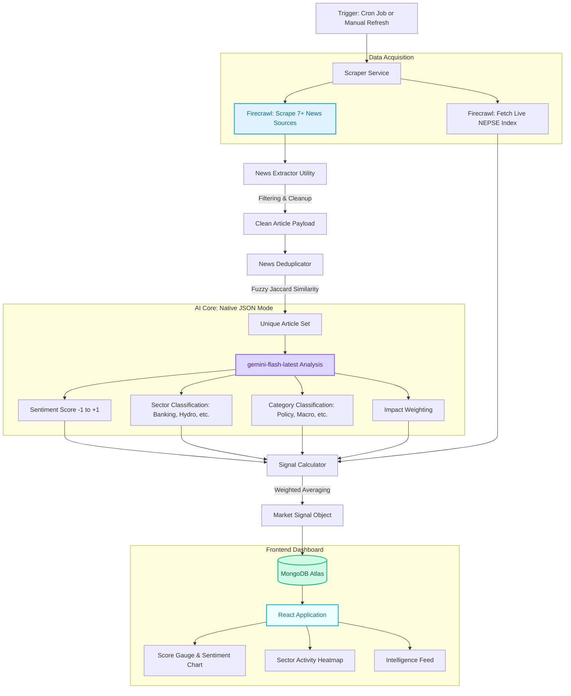

# Artha System Architecture

Artha is a real-time Market Sentiment Engine for the Nepal Stock Exchange (NEPSE). It leverages AI (Gemini), Web Scraping (Firecrawl), and MongoDB to provide high-fidelity market insights with industry-specific granularity.

## 📊 High-Level Workflow

## 🧠 Core Components

### 1. Sensory Input (Scraper & Extractor)

The `ScraperService` orchestrates raw data acquisition, while the `NewsExtractor` utility handles the heavy lifting of cleaning.

- **Noise Filtering**: Automatically ignores non-news links (video tutorials, login pages, newsletter signups).
- **Headline Sanitization**: Strips residual markdown and image tags to ensure clean input for the AI.
- **Failover Indexing**: Multi-source logic ensures the live NEPSE index is captured even if one financial portal is down.

### 2. News Deduplicator

To prevent "Echo Chamber" bias where 5 news outlets report the same event, we use a **Jaccard Similarity** algorithm. It ensures that a single event only impacts the market signal once, regardless of how many sources cover it.

### 3. Intelligence Engine (Gemini 1.5)

The AI analysis has been upgraded to use **Native JSON Response Mode** (`responseMimeType: "application/json"`). This ensures zero parsing errors.

- **Sector Intelligence**: Articles are now mapped to the 13 official NEPSE sectors + a "Market-wide" category.
- **Financial Context**: The engine understands Nepali financial nuances (e.g., NRB directives, IPOs, Dividend declarations).
- **Concurrency Control**: Optimized with `p-limit` to handle batch analysis without hitting API rate limits.

### 4. Logic Layer (SOC & DRY)

The backend follows a strict **Separation of Concerns**:

- **SentimentReporter**: Centralized summary generation logic.
- **SignalCalculator**: Pure mathematical logic for weighting and averaging.
- **ThemeUtility (Frontend)**: A single source of truth for sentiment thresholds and color mapping.

### 5. Frontend Dashboard

A modern UI designed with a custom thematic palette (`#98749e` Primary).

- **Sector Activity Heatmap**: A donut chart visualizing news volume and average sentiment for specific industries.
- **Intelligence Feed**: Displays the "Sector" and "Category" for every analyzed story, allowing for granular audit of the AI's reasoning.

### 6. Ticker Dictionary & Entity Mapping

A centralized dictionary (`tickers.ts`) maps company names to official NEPSE symbols. The `AnalysisEngine` uses this to enrich signals, ensuring that "Nabil Bank" and "NABIL" are seen as the same entity.

### 7. Credibility & Authority Weighting

Sources are no longer equal. Official entities like **NRB**, **NEPSE**, and **SEBON** carry a 1.5x multiplier on their impact weight, while general news portals are normalized to their historical accuracy.

### 8. Event-type Layer

Beyond sentiment, the engine now classifies events into specific categories like `Rights Issue`, `Merger`, `Lock-in Release`, and `Promoter Selloff`. This allows for specialized trigger rules (e.g., Lock-in release usually signals potential downward pressure).

## 🛠️ Tech Stack

- **Frontend**: React 18, Tailwind CSS, Recharts, Lucide.
- **Backend**: Node.js, Express, TypeScript, Node-cron.
- **AI**: Google Generative AI (Gemini Flash).
- **Infrastructure**: Firecrawl (Stealth Scraping), MongoDB (Mongoose).

---

_Artha v3.0 - Predictive Market Intelligence for NEPSE._
