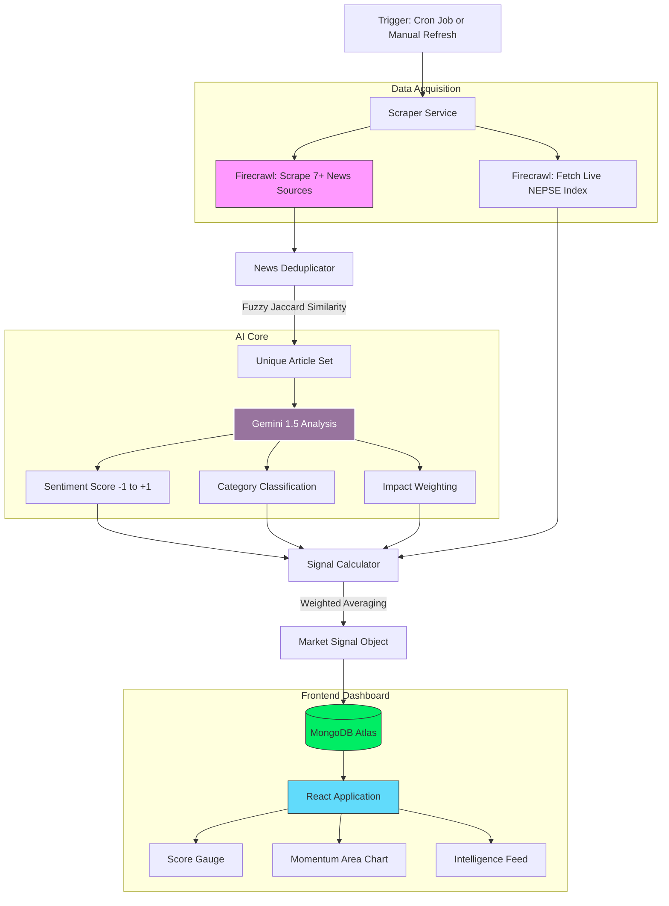

# Artha System Architecture

Artha is a real-time Market Sentiment Engine for the Nepal Stock Exchange (NEPSE). It leverages AI (Gemini), Web Scraping (Firecrawl), and MongoDB to provide high-fidelity market insights.

## 📊 High-Level Workflow

## 🧠 Core Components

### 1. The Scraper (Firecrawl)

The `ScraperService` acts as the sensory input. It dynamically converts complex Nepali news portals into clean Markdown. It features a **Multi-Source Failover** for the NEPSE index—if one financial portal is down, it automatically attempts to fetch the live index from another.

### 2. News Deduplicator

To ensure market signals aren't skewed by redundant reporting, we use a **Jaccard Similarity** algorithm. It normalizes headlines (removing stopwords and special characters) and performs fuzzy matching to ensure a single event reported by multiple outlets only gets analyzed **once**.

### 3. AI Analysis Engine (Gemini)

The system uses the `gemini-1.5-flash` model as a financial analyst. For every unique article, it determines:

- **Sentiment**: Bullish vs Bearish intensity.
- **Category**: Classifies news into _Policy, Dividend, Macro,_ or _General_.
- **Impact Weighting**: Assigns higher importance to regulatory news (NRB) or Blue-chip company announcements.

### 4. Signal Calculator

This service calculates the **Weighted Sentiment Score**. It doesn't treat all news as equal; an NRB interest rate hike carries 3x the weight of general market commentary. This produces the "Market Pulse" score seen on the gauge.

### 5. Frontend Dashboard

A modern, minimalist UI built with React and Tailwind CSS.

- **Score Gauge**: Visual representation of current market fear/greed.
- **Sentiment Chart**: Area chart showing the correlation between AI sentiment trends and the NEPSE index.
- **Intelligence Cards**: Real-time cards showing the specific reasoning behind the AI's classification for each story.

## 🛠️ Tech Stack

- **Frontend**: React, Tailwind CSS, Lucide Icons, Recharts.
- **Backend**: Node.js, Express, TypeScript, Node-cron.
- **AI**: Google Generative AI (Gemini).
- **Data Source**: Firecrawl API (Stealth Headless Scraping).
- **Database**: MongoDB (Mongoose).

---

_Artha v2.0 - Built for Nepali Market Intelligence._
